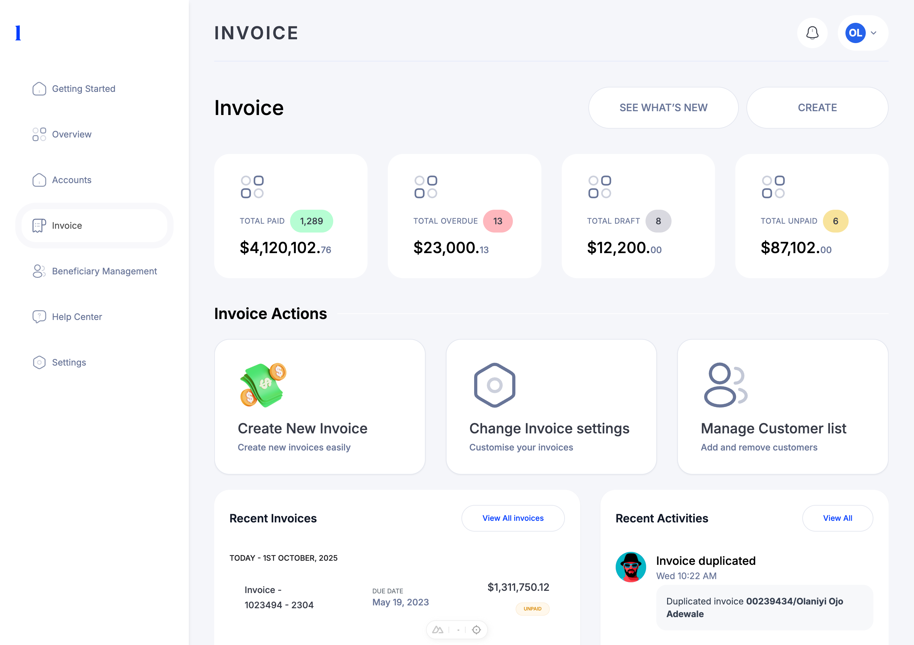

# Invoice App (Assessment Project)

A full-stack invoicing application built as part of the **Frontend Engineer Assessment** for YouVerify.  
This project consists of a **backend (mock API + socket.io)** and a **frontend (Vue 3 + Nuxt + TypeScript app with Firebase authentication)**.  

---

## 🚀 Features
- User Authentication (Sign Up, Login, Logout with Firebase)  
- Invoice Fetching and Duplication  
- Real-time Updates via WebSocket:
  - Activity modal instantly reflects duplicated invoice activity.  
  - Recent invoices update dynamically under the correct date group.  
  - Recent activities on the main page reflect user actions.  
- Responsive UI (desktop + mobile)  
- Error handling for invalid requests & network failures  
- Unit/Integration testing with Vitest & Vue Testing Library  
- Built with **Vue 3, Nuxt, and TypeScript**

---

## 📂 Project Structure
```
root/
│── backend/   # Mock backend (Express, TypeScript, Socket.io)
│── frontend/  # Vue 3 + Nuxt + TypeScript frontend with Firebase + Socket.io client
│── README.md  # This file
```

Each folder (`backend/` and `frontend/`) contains its own README with setup and usage instructions.

---

## 🛠️ Setup Instructions

### 1. Clone the repository
```bash
git clone https://github.com/Damileee/youVerify-assessment.git
cd <youVerify-assessment>
```

### 2. Start the Backend
```bash
cd backend
npm install
npm run dev
```
The backend will run on `http://localhost:4000`.

### 3. Start the Frontend (Vue/Nuxt/TypeScript)
```bash
cd frontend
npm install
npm run dev
```
The frontend will run on `http://localhost:3000`.

---

## 🧪 Testing
Run tests for the frontend:
```bash
cd frontend
npm run test
```

---

## 📸 Screenshots

### Web App (Dashboard)


### Invoice Modal with Real-time Updates


---

## 📖 Notes
- **Login/Signup**: Accessible via the homepage form.  
- **Logout**: Click on the **profile bar with user initials**.  
- **Real-time Testing**:  
  1. Open the modal.  
  2. Click the **More button → Duplicate**.  
  3. The modal updates instantly, showing an **Invoice Duplication** activity.  
  4. Closing the modal shows the duplicated invoice under the correct date in **Recent Invoices**, and the action in **Recent Activities**.  

---

## 📌 References
- [Backend README](./backend/README.md)  
- [Frontend README](./frontend/README.md)  
